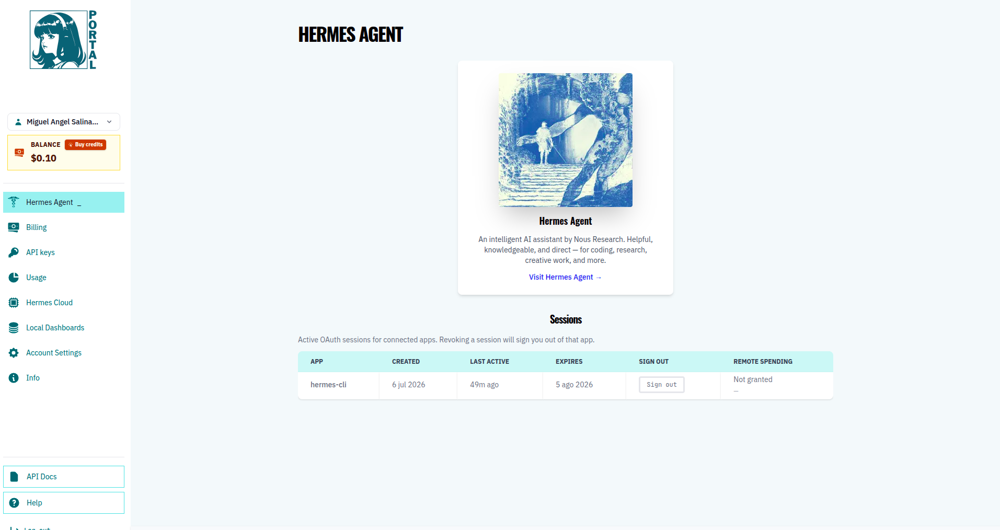
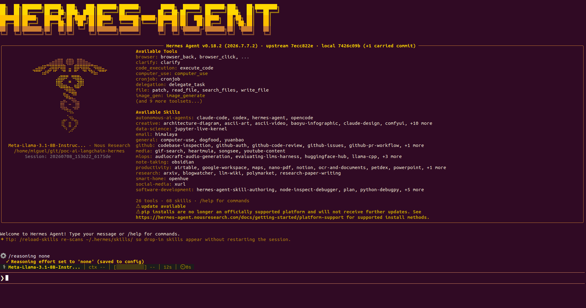

# Description
PoC Integration between Landchain and Hermes Agent

## Comments

To use Hermes Agent, you must use the hermes agent class called AIAgent. This agent under the hood, use the Nous Research Inference API (https://inference-api.nousresearch.com/v1). If exist any session under hermes/shared/nous_auth.json created it will use, if not you must use a API Key created under portal

This API use public AIs like: Claude (be carefull with your token plan credits) for reasoning. You must have an Hermes Account and a plan to use the Hermes API or other Hermes public resources. These credentials are created when you install hermes CLI locally in your computer the first time under ./hermes folder. To use Hermes API you must to have a plan under your account. Be carefull about your tokens credential.



If you want not use any public Hermes resources. You can configure Hermes to use the custom model endpoint: http://localhost:11434/v1 used by Ollama. Execute this comamnd to configure the model manager:

```bash
$ hermes model
```

And select Custom model endpoint, then set the custom uri for your model manager Ollama (http://localhost:11434/v1) and finally select a local model just pulled in your ollama host service. Also locally you must deactivate the reasoning from hermes CLI executing the command 

```bash
    /reasoning none
```s



If you have GPU you can use this model: MFDoom/deepseek-r1-tool-calling:8b with good reasoning level and limit resources.

## Dependencies

```bash
$ pip install git+https://github.com/NousResearch/hermes-agent.git
$ pip install langgraph
```

## Links

- [API Swagger documentation](https://portal.nousresearch.com/api/openapi)
- [API Docs](https://portal.nousresearch.com/api-docs)
- [API Prices](https://portal.nousresearch.com/info)